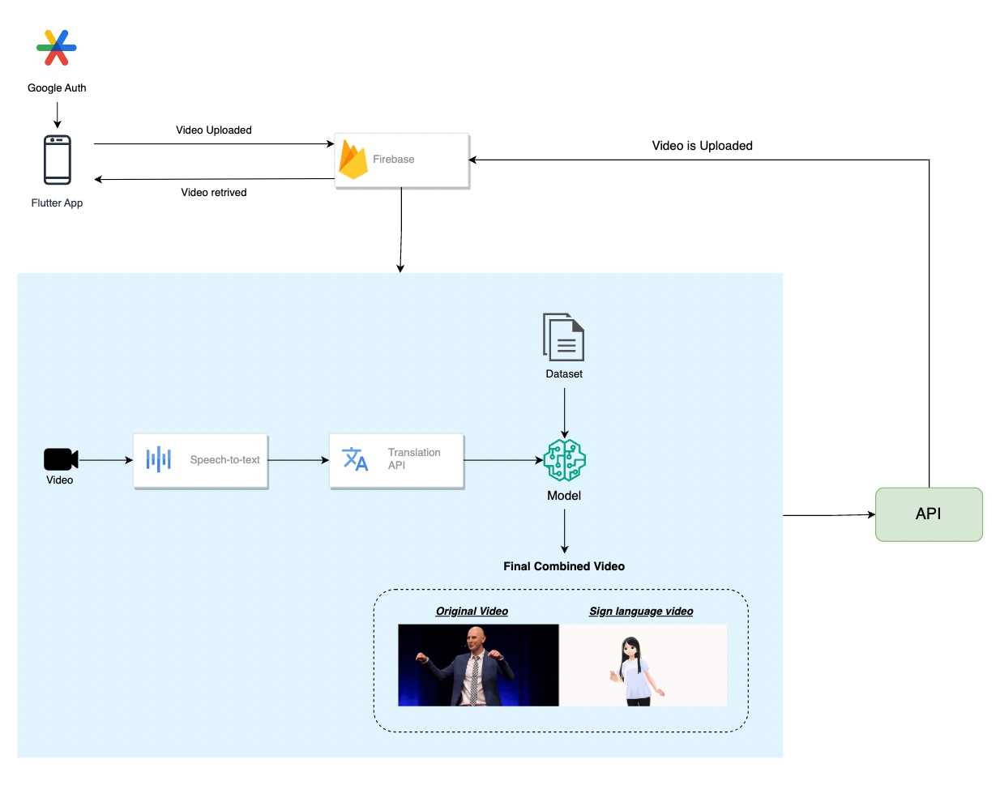
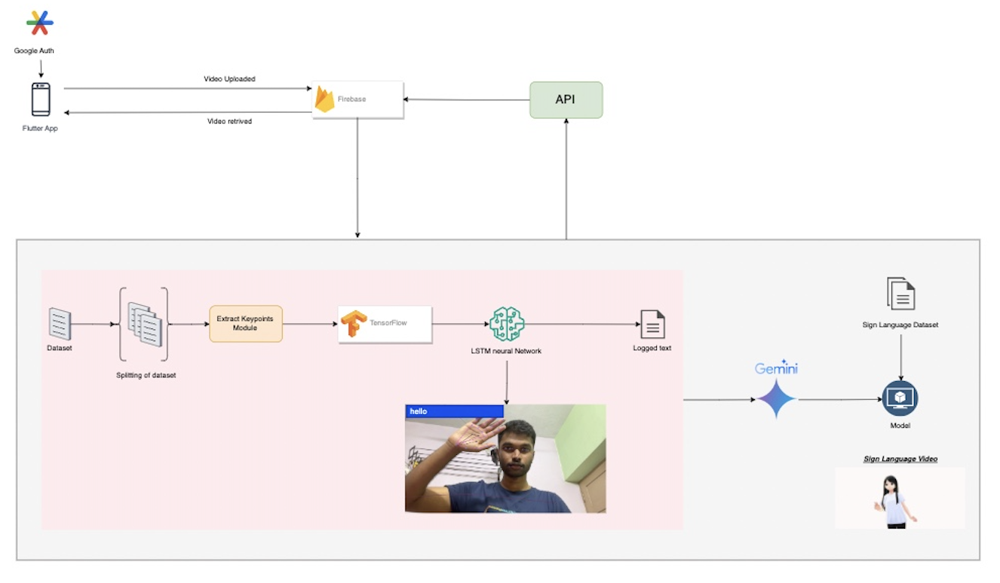

# sign-sculpt

## Project Description
This application enables the generation of sign language from video content, enriching educational experiences for individuals with hearing and speech impairments. Moreover, it includes a specialized chatbot that communicates using sign language, offering tailored responses to their inquiries and promoting inclusive communication.


## Schematic view of solution
### Video to Sign Language


### Sign Language Chatbot


## Prerequisites

* Install Flutter
* Install git
* Install python==3.11.4


## Procedure to run this application

1. Clone the repository using the below command
```
git clone https://github.com/vamsikeshwaran/sign-sculpt
```
2. Tranverse to the project directory using below command
```
cd sign-sculpt
```
3. Install required dependencies
```
pip install -r requirements.txt
```
4. Traverse to the below directory
```
cd final_app/python
```
5. Run following python application
```
python app.py
python app1.py
python bot.py
python sign.py
python text.py
```
10. Traverse to the below directory
```
cd ../app
```
11. Run Flutter app
```
flutter run
```
## Demo Video 

link: https://www.youtube.com/watch?v=Nx0LDM5VT4M


